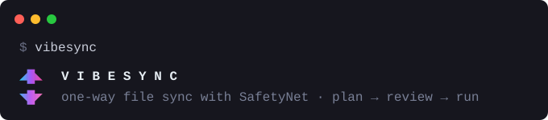

  

# VibeFileSync

`vibesync` is a crash-safe, one-way file-sync tool for macOS on Apple Silicon: a single pure-Rust binary that mirrors or updates folders onto external drives (APFS and exFAT) without ever silently losing a previous version.

Every run is **review-first**: `plan` shows a comprehensible dry-run diff before anything mutates, `run` asks before executing, and agents get the same plan as an NDJSON stream. A `ratatui` TUI (`vibesync tui`) offers the same review over a staged, fully keyboard-operable interface. The CLI is the documented accessible path for screen-reader users.

## Safety is the product

- **SafetyNet** — before any run removes or replaces an existing destination object, the previous version is archived by rename into a visible, Finder-browsable `_SafetyNet/<run-id>/` tree. Restore is an ordinary copy-back; no tool required.
- **Verification gate** — every copy is born as a dot-temp, fsynced (`fsync` + `F_FULLFSYNC`), verified (stat + xattr always, full hash under `--verify`), and only then published by rename. A final path never holds a partial file.
- **Convergence** — after any interruption (crash, unplugged drive, full disk), one rerun's fresh scan converges the destination. Recovery is always "run it again", never manual repair.
- **Honest records** — a retained per-run journal feeds `status` and `history` but never decides what to copy; an interrupted run is permanently visible as such.

## Built for scripts and agents

`plan --json` and `run --json` stream versioned NDJSON events, every guard is deterministic and abort-by-default with explicit per-run overrides, and the exit-code taxonomy (0 clean · 1 partial · 2 precondition abort · 3 blocked plan · 4 interrupted · 64 usage) lets callers branch without parsing JSON.

## Managing Folder pairs

`pair list --source <PATH>` finds the pair for wherever you're standing, matched by directory identity rather than a stored path string. Add `--check` to see each pair's volume state at a glance — mounted, relocated, absent, or otherwise — without opening it. `pair add --replace` redefines an existing pair (new paths, re-pinned volumes) in one atomic save, keeping its name and run history intact.

## Status

v1 is under active development from the spec in [issue #14](https://github.com/phassle/VibeFileSync/issues/14), broken into tracer-bullet tickets ([#15–#28](https://github.com/phassle/VibeFileSync/issues?q=label%3Aready-for-agent)).

- **Quickstart**: [`docs/quickstart.md`](docs/quickstart.md) — build, create a Folder pair, and make your first run
- **Domain glossary**: [`CONTEXT.md`](CONTEXT.md) — the normative vocabulary (Folder pair, Mirror, SafetyNet, Publish, Convergence, …)
- **Architecture decisions**: [`docs/adr/`](docs/adr/) — ADR-0001…0012 back every decision in the spec
- **Agent instructions**: [`AGENTS.md`](AGENTS.md) — issue tracker, triage labels, gitflow
